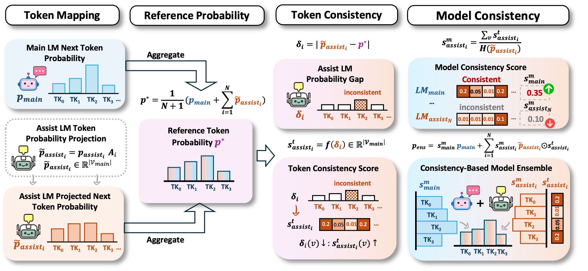
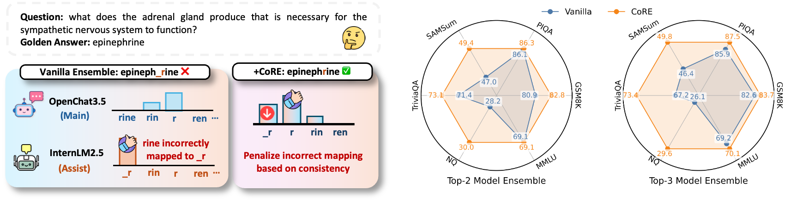
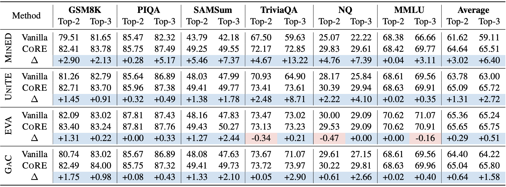
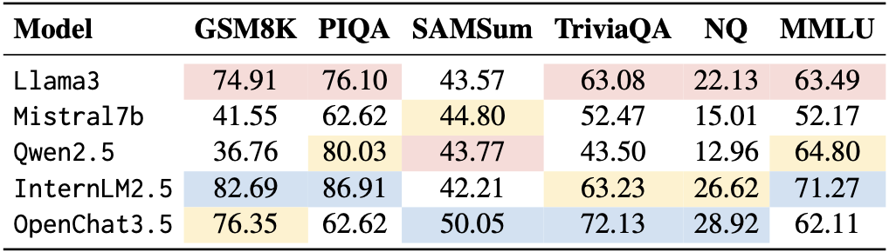
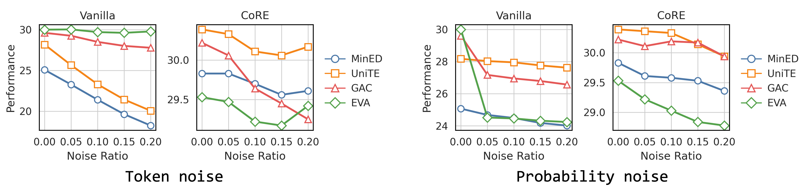

# CoRE (Harnessing Consistency for Robust Test-Time LLM Ensemble)

<p align="center">
    <a href="https://arxiv.org/abs/2510.13855">
</a>


## 💡 Introduction
This is the official repo for the paper [Harnessing Consistency for Robust Test-Time LLM Ensemble](https://arxiv.org/abs/2510.13855) in EACL 2026.

<a name="readme-top"></a>

<p align="center">
  <picture>
    <source media="(prefers-color-scheme: dark)" srcset="assets/overview.png">
    
  </picture>
</p>

<p align="center">
  <picture>
    <source media="(prefers-color-scheme: dark)" srcset="assets/teaser.png">
    
  </picture>
</p>

CoRE is a plug-and-play technique that improves ensemble robustness by promoting consistency across both tokens and models. CoRE enjoys the following key benefits:

- **Bi-level consistency**: penalize uncertain, highly inconsistent tokens via *token-level consistency*, while prioritizing confident and consistent model outputs via *model-level consistency*

- **Plug-and-play integration**: works with diverse ensemble methods and model combinations with no additional inference cost

- **Consistent gains**: improves both ensemble accuracy and robustness across benchmarks, ensembles, and model combinations

## 📊 Experiment Overview

We evaluate ensemble results with (CoRE) and without (Vanilla) CoRE on 6 benchmark datasets, spanning reasoning, summarization, knowledge, and comprehensive examination.
- **Ensemble results**: CoRE consistently enhances vanilla ensemble performance and achieves more stable ensemble.
<p align="center">
  <picture>
    <source media="(prefers-color-scheme: dark)" srcset="assets/benchmark.png">
    
  </picture>
</p>

- **Base model results**: we use blue/yellow/red to denote Top-1/2/3 models.
<p align="center">
  <picture>
    <source media="(prefers-color-scheme: dark)" srcset="assets/base_model.png">
    
  </picture>
</p>

- **Robustness results**: CoRE enhances ensemble robustness against token noise (noises on token alignment) and probability noise (noises on logits).
<p align="center">
  <picture>
    <source media="(prefers-color-scheme: dark)" srcset="assets/robust.png">
    
  </picture>
</p>

## ⚙️ Environment Setup
### 1. Clone the repository
```
git clone https://github.com/zhichenz98/CoRE-EACL26
cd CoRE-EACL26
```

### 2. Install packages
```
ENV_NAME=core PYTHON_VERSION=3.9 INSTALL_FLASH_ATTN=1 bash setup.sh
conda activate core
```


## 🧪 Running Experiments

### 1. Inference

Perform model inference via either command or bash file

#### Option 1: Run via command
```
python src/run.py --main_model InternLM7b --assist_model OpenChat --align_method mined --variant consist-rbf --task NQ
```
- **```--align_method```**: token alignment method; choose from ```mined, unite, eva, gac```.
- **```--variant```**: CoRE variant; choose from ```vanilla``` or CoRE variants ```consist-linear, consist-rbf, consist-power,consist-rec```.
- **```--task```**: choose from ```GSM8K, PIQA, SAMSum, TriviaQA, NQ, MMLU```.

#### Option 2: Run via bash file
```
bash run.sh
```

### 2. Evaluation
```
bash eval.sh
```

## 🤝 Ackonwledgements
This repo is largely built upon the wonderful [DeepEN](https://github.com/OrangeInSouth/DeePEn).

## 📚 Citation
💫 If you find **CoRE** helpful, please kindly give us a star and cite below. Thanks!
```
@article{zeng2025harnessing,
  title={Harnessing Consistency for Robust Test-Time LLM Ensemble},
  author={Zeng, Zhichen and Yu, Qi and Lin, Xiao and Qiu, Ruizhong and Ning, Xuying and Wei, Tianxin and Yan, Yuchen and He, Jingrui and Tong, Hanghang},
  journal={arXiv preprint arXiv:2510.13855},
  year={2025}
}
```